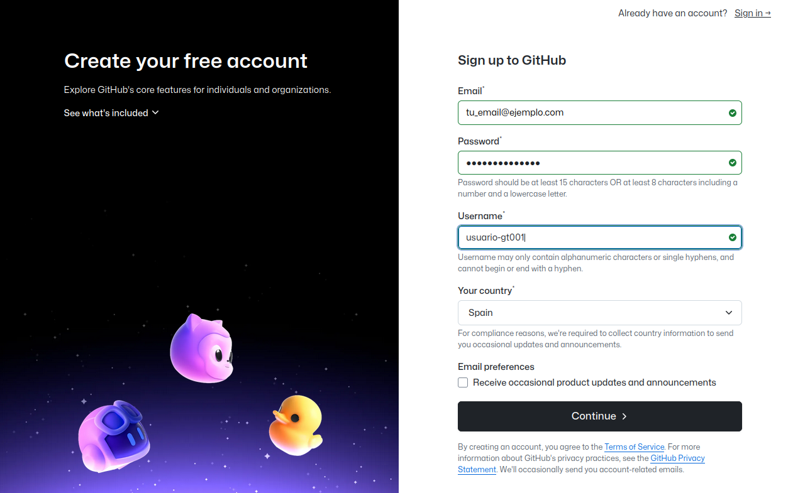
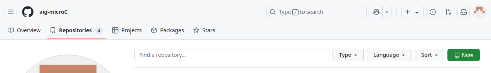

##########################
GitHub y git, sucintamente
##########################

:Autor: Angel de la Iglesia Gonzalo
:Versión/rev: 0/1
:Fecha:	20250505/20250430
:Copyright: Este trabajo está bajo licencia *Creative Commons BY-NC-SA 4.0* (https://creativecommons.org/licenses/by-nc-sa/4.0/deed.es) que te permite compartir, adaptar y redistribuir esta obra, siempre y cuando des crédito de manera adecuada a la obra original, no hagas uso con propósito comercial de la obra y si compartes tu nueva obra, lo hagas bajo esta misma licencia.
:Asbstract: This document is an introduction and a short tutorial on *GitHub* and *git*. **Resumen**: Este documento es una introducción y un pequeño tutorial sobre *GitHub* y *git*.

.. sectnum::
.. header:: ###Title### - Sección: ###Section###
.. footer:: ###Page###

.. meta::
    :keywords: pdf, html, GitHub, git, tutorial, introducción
    :description lang=es: Una introducción o tutorial a GitHub y git

|
|
|

.. figure:: imágenes/captura_GitHub.png
   :width: 100%
   :align: center
   :target: https://GitHub.com/aig-microC/Debian_en_Rpi
   
   **Captura de la imágen de una página de GitHub**.

.. raw:: pdf

   PageBreak paginaIndice
   SetPageCounter 1 lowerroman
    
.. contents:: Índice
   :backlinks: top

.. raw:: pdf

    PageBreak Normal
    SetPageCounter 1
    

************
Introducción
************

**GitHub y git, sucintamente** tiene la intención de ser un tutorial *mínimo* para saber cómo crear una cuenta en Github_ y como manejar un proyecto con git_.

.. _git: https://git-scm.com/

**************************
Crear una cuenta en GitHub
**************************

Fuente: https://docs.GitHub.com/en/get-started/start-your-journey/creating-an-account-on-GitHub

Para crear una cuenta en *GitHub* hay que dirigirse a la página https://GitHub.com/signup?source=form-home-signup&user_email= y seguir el procedimiento que te irá presentado sucesivamente.

Durante el registro, se te pedirá que verifiques tu dirección de correo electrónico. Sin una dirección de correo electrónico verificada, no se podrá completar ninguna de las tareas básicas de GitHub tal como crear un repositorio, que es lo que vamos buscando.

.. _Fuente:

Fuente: 

https://docs.github.com/en/authentication/securing-your-account-with-two-factor-authentication-2fa/configuring-two-factor-authentication#configuring-two-factor-authentication-using-a-totp-app

*GitHub* cuida bastante la seguridad de acceso a los repositorios y hay varias formas de acceder que puedes ver en `Configuring two-factor authentication <https://docs.GitHub.com/en/authentication/securing-your-account-with-two-factor-authentication-2fa/configuring-two-factor-authentication#configuring-two-factor-authentication-using-a-totp-app>`_. Yo te recomiendo utilizar una aplicación, para la autenticación temporal en dos `pasos  <https://en.wikipedia.org/wiki/Comparison_of_OTP_applications>`_, que puedes encontrar en tu *tienda de aplicaciones* para el *móvil*. Hay muchas, pero si no conoces ninguna puedes empezar mirando las de las grandes compañías de *software* como `Google Authenticator <https://play.google.com/store/apps/details?id=com.google.android.apps.authenticator2&hl=es>`_ o `Microsoft Authenticator <https://play.google.com/store/apps/details?id=com.azure.authenticator&hl=es>`_ y si prefieres una *app* de *código abierto* mira `FreeOTP Authenticator <https://play.google.com/store/apps/details?id=org.fedorahosted.freeotp>`_, además puedes ver su repositorio en https://freeotp.GitHub.io/.

Casi literalmente de la Fuente_ de este párrafo:

Una aplicación de contraseña de un solo uso basada en el tiempo (TOTP) genera automáticamente un código de autenticación que cambia después de un cierto período de tiempo. Estas aplicaciones se pueden descargar al teléfono o computadora de escritorio. Recomendamos utilizar aplicaciones TOTP basadas en la nube. *GitHub* es independiente de las aplicaciones TOTP, por lo que tienes la libertad de elegir cualquier aplicación TOTP que prefieras. Simplemente busca la aplicación TOTP en tu navegador para encontrar varias opciones. También puedes refinar la búsqueda agregando palabras clave como gratis o de código abierto para que coincidan con tus preferencias.

Los pasos para configurar la TOTP son:

1)	Descarga una aplicación TOTP de tu elección en tu teléfono o en el ordenador.

2)	En la esquina superior derecha de cualquier página de *GitHub*, haz clic en tu foto de perfil y luego haz clic en ⚙ (el icono que tiene forma de rueda dentada) que corresponde a **Settings**. 

3)	En la sección "**Access**" de la barra lateral, haz clic en **Password and authentication**.

4)	En la sección "**Two-factor authentication**" de la página, haz clic en "**Enable two-factor authentication**".

5)	En "**Scan the QR code**", realiza una de las siguientes acciones:

	    - Escanea el código QR con la aplicación de tu dispositivo móvil. Después de escanear, la aplicación muestra un código de seis dígitos que puedes introducir en GitHub.
	    
	    - Si no puedes escanear el código QR, haz clic en la clave de configuración para ver un código, la clave de TOTP, que puedes introducir manualmente en la aplicación TOTP.

6)	La aplicación TOTP guarda tu cuenta en GitHub.com y genera un nuevo código de autenticación cada pocos segundos. En GitHub, escribe el código en el campo debajo de "**Verify the code from the app**".

7)	En "**Save your recovery codes**", haz clic en **Download** para descargar sus códigos de recuperación a su dispositivo. Guárdalos en una ubicación segura porque tus códigos de recuperación pueden ayudarte a volver a entrar en tu cuenta si pierdes el acceso.

8)	Después de guardar tus códigos de recuperación de dos factores, haz clic en **I have saved my recovery codes** para habilitar la autenticación de dos factores para tu cuenta.

9)	Opcionalmente, puedes configurar métodos 2FA adicionales para reducir el riesgo de bloqueo de cuenta. Para obtener más detalles sobre cómo configurar cada método adicional, consulta `Configurar la autenticación de dos factores usando una clave de seguridad <https://docs.github.com/en/authentication/securing-your-account-with-two-factor-authentication-2fa/configuring-two-factor-authentication#configuring-two-factor-authentication-using-a-security-key>`_ y `Configurar la autenticación de dos factores usando GitHub Mobile <https://docs.github.com/en/authentication/securing-your-account-with-two-factor-authentication-2fa/configuring-two-factor-authentication#configuring-two-factor-authentication-using-github-mobile>`_.

Configurar GitHub
=================

Supongo que ya tienes una cuenta en GitHub_.

.. _GitHub: https://GitHub.com/

Para *GitHub* es necesario (hay alguna forma más) poder establecer una conexión *SSH*.

Fuente: https://docs.GitHub.com/en/authentication/connecting-to-GitHub-with-ssh/checking-for-existing-ssh-keys

Para comprobar si tenemos claves *SSH* (SSH keys) en nuestro ordenador teclear:

.. code:: bash

	$ ls -al ~/.ssh
	total 24
	drwx------  2 angel angel 4096 abr  9 11:12 .
	drwx------ 53 angel angel 4096 abr 10 15:51 ..
	-rw-------  1 angel angel  464 abr  9 10:44 id_ed25519
	-rw-r--r--  1 angel angel   96 abr  9 10:44 id_ed25519.pub
	-rw-------  1 angel angel  978 abr  9 11:12 known_hosts
	-rw-r--r--  1 angel angel  142 abr  9 11:05 known_hosts.old

Los tipos que acepta *GitHub* son:

- id_rsa.pub
- id_ecdsa.pub
- id_ed25519.pub

Si el subdirectorio anterior aparece vacío es que no tenemos y tendremos que generarla (o si nos ha caducado la nuestra y necesitamos generar otra).

.. _`Fuente de información`:

Fuente: https://docs.GitHub.com/en/authentication/connecting-to-GitHub-with-ssh/generating-a-new-ssh-key-and-adding-it-to-the-ssh-agent

En el terminal teclea:

.. code:: bash

	ssh-keygen -t ed25519 -C "tu_email@ejemplo.com"

Y responderá con algo parecido a esto:

.. code:: bash

	> Enter a file in which to save the key (/home/YOU/.ssh/id_ALGORITHM):
	[Press enter]

Responde con *intro* para aceptar el nombre por defecto.

A continuación te pedirá la *frase contraseña* (*passphrase*). Tenla preparada con antelación. Debería tener 20 o más caracteres, con mayúsculas, minúsculas, dígitos, símbolos de puntuación... Ya sabes lo recomendado para contraseñas. Guárdala en un lugar seguro, porque si no, no podrás establecer la conexión.

> Enter passphrase (empty for no passphrase): [Type a passphrase]
> Enter same passphrase again: [Type passphrase again]

Ahora hay que añadir la clave *SSH* a un agente (ssh-agent). Para hacerlo:

.. code:: bash

	$ eval "$(ssh-agent -s)"

y deberá responder con algo parecido a:

.. code:: bash

	Agent pid 25519

Apunta el número de *pid* que te sale a ti.

Si no te aparece ve a la `Fuente de información`_ de este apartado para probar otras cosas.

Ahora hay que añadir la clave al agente *ssh* con el número de pid que te salió a ti:

.. code:: bash

	$ ss-add ~/.ssh/id_ed25519

Ahora hay que añadir una nueva *clave SSH* a tu cuenta de *GitHub*

Fuente: https://docs.GitHub.com/en/authentication/connecting-to-GitHub-with-ssh/adding-a-new-ssh-key-to-your-GitHub-account

..    Puedes agregar una *clave SSH* y usarla para la autenticación, la firma de confirmación o ambas. Si quieres usar la misma *clave SSH* para la autenticación y la firma, debes cargarla dos veces.

    Después de añadir una nueva clave de autenticación SSH a tu cuenta en GitHub.com, puedes reconfigurar cualquier repositorio local para usar SSH.

Hay que copiar el contenido de id_ed2519.pub (con el id que te haya salido a a ti) en el portapapeles:

.. code:: bash

	$ cat ~/.ssh/id_ed25519.pub

Y te deberá aparecer algo parecido a (un chorro de letras, números y caracteres):

.. code:: bash

	ssh-ed25519 AAAAC3 ... tu_email@ejemplo.com

Si te resulta complicado copiarlo en el portapapeles puedes abrir el fichero con un editor de texto y copiarlo de allí.

En la esquina superior derecha de cualquier página de GitHub, haz clic en tu foto de perfil (si no la tienes aparece un icono) y luego en

**Settings** (Configuración). Tiene una rueda dentada como icono (⚙).

En la sección "Acceso" de la barra lateral, haz clic en

**SSH and GPG keys** (Claves SSH y GPG). Tiene una llave de puerta como icono.

Haz clic en **NEW SSH KEY** (Nueva clave SSH) o en Añadir *clave SSH*.

En el campo **Title** (Título), añade una etiqueta descriptiva para la nueva clave. Por ejemplo, si usas un portátil personal, podrías llamarla "Portátil personal".

Selecciona el tipo de clave: **Authentication key** o **Signing Key** (autenticación o firma). Selecciona **Authentication key**. 

En el campo **Key** (Clave), pega tu clave pública.

Haz clic en **Add SSH Key** (Añadir clave SSH).

Si se te solicita, confirma el acceso a tu cuenta de GitHub.

Creación de un repositorio vacío en *Github*
============================================

En tu página base de *github* pulsa sobre *Repositories* en la barra que aparece debajo del nombre de tu página.

.. figure:: imágenes/Creación_repositorio.png
   :width: 100%
   :align: center
   
   **Creación de un repositorio en github-01**.

En la siguiente página que aparece pulsa sobre **NEW**:

   
   **Creación de un repositorio en github-02**.

y crea el repositorio vacío pulsando en **Create repository**.

.. figure:: imágenes/nombre_de_mi_repo.png
   :width: 100%
   :align: center
   
   **Creación de un repositorio en github-03**.

********************************
Usar *git* en el ordenador local
********************************

Yo utilizo como sistema de desarrollo `Debian`_, pero no deberías tener muchos problemas en utilizar los ejemplos en cualquier otra distribución *Linux* e incluso en otros *SO* donde se pueda ejecutar *git*.  

.. _`Debian`: https://www.debian.org/

Para instalar *git* el comando es *sudo apt install git* o mejor *sudo apt install git-all* que instala, además, paquetes auxiliares muy convenientes.

Inicialización del proyecto
===========================

Supongo que tienes un proyecto creado que tiene varios subdirectorios en los que tienes ficheros creados de los que quieres tener control y otros de los que no es necesario tener controlados.

Ponte en el subdirectorio raíz de tu proyecto y teclea.

.. code:: bash

    git init

Con esto se crea la infraestructura necesaria para mantener un proyecto en modo local y aparece un subdirectorio oculto llamado .git. Cuando lo generes aparecerá algo momo:

.. code:: bash

    $ git init
    ayuda: Usando 'master' como el nombre de la rama inicial. Este nombre de rama predeterminado
    ayuda: está sujeto a cambios. Para configurar el nombre de la rama inicial para usar en todos
    ayuda: de sus nuevos repositorios, reprimiendo esta advertencia, llama a:
    ayuda: 
    ayuda: 	git config --global init.defaultBranch <nombre>
    ayuda: 
    ayuda: Los nombres comúnmente elegidos en lugar de 'master' son 'main', 'trunk' y
    ayuda: 'development'. Se puede cambiar el nombre de la rama recién creada mediante este comando:
    ayuda: 
    ayuda: 	git branch -m <nombre>
    Inicializado repositorio Git vacío en /home/angel/mi_Tutorial_GITHUB-GIT/.git/

Si haces ``ls -al`` sobre tu subdirectorio raíz del proyecto verás algo parecido a (el ejemplo está hecho sobre este mismo proyecto).

.. code:: bash

    $ ls -al
    total 784
    drwxr-xr-x 4 angel angel   4096 abr 30 16:13 .
    drwxr-xr-x 3 angel angel   4096 abr 11 14:34 ..
    -rw-r--r-- 1 angel angel   1157 abr 11 16:13 estilo-001.yaml
    -rw-r--r-- 1 angel angel      0 abr 30 16:12 Fichero_de_Fechas_de_Ediciones.txt
    drwxr-xr-x 7 angel angel   4096 abr 30 16:13 .git
    drwxr-xr-x 2 angel angel   4096 abr 11 15:53 imágenes
    -rw-r--r-- 1 angel angel    195 abr 30 15:33 README.md
    -rw-r--r-- 1 angel angel  31859 abr 30 16:08 Tuto_github.html
    -rw-r--r-- 1 angel angel 726168 abr 30 16:08 Tuto_github.pdf
    -rw-r--r-- 1 angel angel  13235 abr 30 16:08 Tuto_github.rst

Inclusión de los ficheros a controlar
=====================================

De los ficheros que hay en el subdirectorio de trabajo quiero mantener el control de todos ellos (y del contenido del subdirectorio *imágenes*) salvo del fichero *Fichero_de_Fechas_de_Ediciones.txt* que es un fichero para mi referencia pero sin utilidad en el proyecto. Para controlar todos estos ficheros el comando es:

.. code:: bash

    $ git add Tuto* README.md estilo-001.yaml imágenes/

Te recomiendo emplear ``git add`` a los ficheros *uno a uno* de los que quieras controlar (*git* puede usar un comodín para añadir todos, pero no suele ser la mejor opción porque incluye toda la posible morralla que tu proyecto pueda generar). Para los subdirectorios lo mismo: Si quieres incluir todo el subdirectorio pon su nombre (como en este caso) y si quieres solo determinados ficheros nómbralos con el *path* desde la base del proyecto (por ejemplo  imágenes/captura_GitHub.png).

Para ver los ficheros que se han añadido y los que no, así como los cambios que debemos (o no) confirmar, el comando es:

.. code:: bash

    $ git status
    En la rama master
    
    No hay commits todavía
    
    Cambios a ser confirmados:
      (usa "git rm --cached <archivo>..." para sacar del área de stage)
	    nuevos archivos: README.md
	    nuevos archivos: Tuto_github.html
	    nuevos archivos: Tuto_github.pdf
	    nuevos archivos: Tuto_github.rst
	    nuevos archivos: estilo-001.yaml
	    nuevos archivos: "im\303\241genes/GitHub-crear_usuario-001.png"
	    nuevos archivos: "im\303\241genes/captura_GitHub.png"
    
    Archivos sin seguimiento:
      (usa "git add <archivo>..." para incluirlo a lo que será confirmado)
	    Fichero_de_Fechas_de_Ediciones.txt

La respuesta nos indica que no hay *commits* todavía. Para consignar (commit) los ficheros, es decir poner en control el comando es:

.. code:: bash

    git commit -a 

Se abrirá una ventana con el editor por defecto para poner un comentario. En la primera vez que lo creas el comentario puede ser "*PRIMERA VERSIÓN*".

Si ahora haces ``git status`` verás algo parecido a:

.. code:: bash

    $ git status
    En la rama master
    Archivos sin seguimiento:
      (usa "git add <archivo>..." para incluirlo a lo que será
      confirmado) Fichero_de_Fechas_de_Ediciones.txt
    
    no hay nada agregado al commit pero hay archivos sin seguimiento
    presentes (usa "git add" para hacerles seguimiento)

en lo que puedes ver que solo está fuera de seguimiento el fichero *Fichero_de_Fechas_de_Ediciones.txt*, tal como quería.

Si, entre tanto, has incluido nuevos ficheros que quieres controlar, al hacer ``git status`` te aparecerán indentificados los nuevos ficheros y para incluirlos deberás hacer ``git add nombre_de_fichero``. 

Llevar el proyecto a un repositorio de *github*
===============================================

Si no tienes repositorio remoto el comando

.. code:: bash

    git remote -v

no devolverá nada. Para crear el repositorio (lo has creado vacío previamente en *Github*. Ver `Creación de un repositorio vacío en Github`_)

.. code:: bash

    $ git remote add origin git@GitHub.com:aig-microC/Github-git-sucintamente

ahora si haces ``git remote -v`` devuelve:

.. code:: bash

    $ git remote -v
    origin	git@GitHub.com:aig-microC/Github-git-sucintamente (fetch)
    origin	git@GitHub.com:aig-microC/Github-git-sucintamente (push)

Asignamos la rama a *main*

.. code:: bash

    $ git branch -M main

y hacemos:

.. code:: bash

    $ git remote add origin git@GitHub.com:aig-microC/Github-git-sucintamente
    error: remoto origin ya existe.

Asegúrate que el fichero de configuración contiene (con los datos de tu proyecto):

.. code:: bash

    $ cat .git/config 
    [core]
	    repositoryformatversion = 0
	    filemode = true
	    bare = false
	    logallrefupdates = true
    [remote "origin"]
	    url = git@GitHub.com:aig-microC/Github-git-sucintamente
	    fetch = +refs/heads/*:refs/remotes/origin/*
    [branch "main"]
	    remote = origin
	    merge = refs/heads/main

Y ahora sí llevamos nuestro proyecto al repositorio de *github*.

.. code:: bash

    $ git push -u origin main

Te pedirá la *passphrase* que creamos en `Configurar GitHub`_ y obtendrás algo parecido a:

.. code:: bash

    Enumerando objetos: 62, listo.
    Contando objetos: 100% (62/62), listo.
    Compresión delta usando hasta 2 hilos
    Comprimiendo objetos: 100% (61/61), listo.
    Escribiendo objetos: 100% (62/62), 3.11 MiB | 3.85 MiB/s, listo.
    Total 62 (delta 1), reusados 0 (delta 0), pack-reusados 0
    remote: Resolving deltas: 100% (1/1), done.
    To GitHub.com:aig-microC/Debian_en_Rpi.git
     * [new branch]      main -> main
    rama 'main' configurada para rastrear 'origin/main'.

Y ya estará el repositorio transferido.

Modificaciones en tu ordenador local y traslado al repositorio
==============================================================

Despues de modificar lo que sea necesario, hacemos

.. code:: bash

    $ git status

para ver que ficheros hemos modificado y a continuación:

.. code:: bash

    $ git commit -a

Con el comentario que consideres oportuno.

Y llevamos nuestras modificaciones al repositorio con:

.. code:: bash

    $ git push

Si hubieramos hecho las modificaciones directamente en el repositorio de *github*, para traernos las modificaciones haríamos 

Para traerse las modificaciones hechas en GitHub (que no he mencionado en este documento):

.. code:: bash

    $ git pull

************************
Para saber más sobre git
************************

*git* sirve para controlar las versiones de un proyecto, especialmente del tipo "*ficheros fuente*" para lenguajes de programación, pero también sirve para cualquier proyecto que necesite tener controlados múltiples ficheros.

Existe mucha información en *internet* sobre *git*. La documentación oficial la puedes encontrarla en https://git-scm.com/doc, donde podrás leer o descargar el libro *oficial* (*Pro Git*) en inglés y su versión en español (que suele estar desactualizada con respecto a la versión inglesa) en https://git-scm.com/book/es/. Pero, en mi opinión, la información más útil para el principiante viene en las páginas *man* de tu sistema o en el subdirectorio de *documentación* de tu ordenador. En especial son muy útiles las siguientes referencias:

.. code-block:: bash

   $ man git
   $ man gittutorial
   $ man giteveryday
   $ firefox file:///usr/share/doc/git/html/user-manual.html

